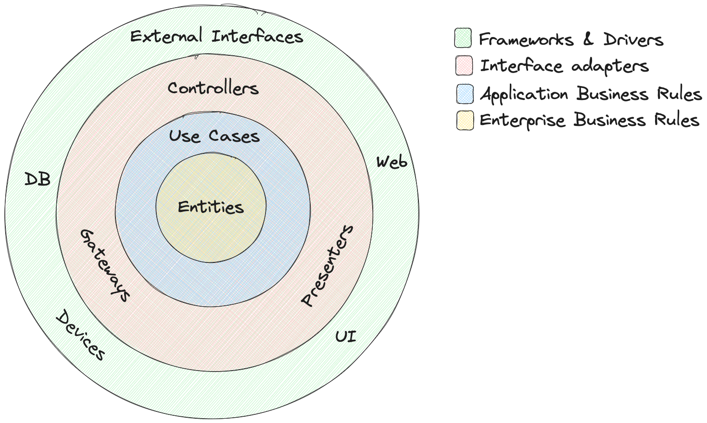
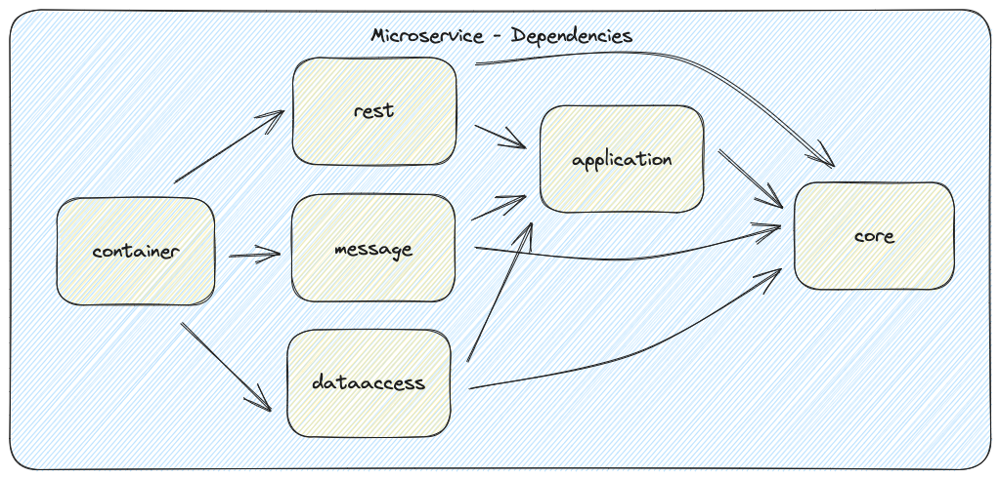

## Description

## Architecture

The system is built upon Clean Architecture where the outer layer only knows about the inner layers, and they are
separeated with interfaces.
The inner core have all the business rules and domain model. 

The application project contains use cases/service interfaces which can be implemented by the outer layers.

The implementation details is kept in their own projects, so
that database layer doesn't have to know about what messaging is implemented, or rest interface needs to know about the
database implementation.

The inner layers should not have dependencies or know anything about the outer layer, they shall be pure, which makes it
easy to test and makes the outer layers easy to change.

Since everything is communicating through interfaces it should be easy to swap between Kafka and ActiveMQ or different
database implementations. This is a good thing if we want to deploy a system locally or in the cloud, and need to switch
to a different implementation.

### Microservices

A microservice has at least three parts to separate layers and dependencies, I chose to split up the infrastructure (
rest, messaging, database in its own projects).

| Module        | Description                                                                              |
|---------------|------------------------------------------------------------------------------------------|
| cqrs-core     | Core interfaces and classes shared between domain                                        |
| *-domain      | The core for the service domain objects are stored here like entities, vo and interfaces |
| *-application | Service layer, logic and ports                                                           |
| *-rest        | Rest API                                                                                 |
| *-messaging   | Implementations of communication (kafka)                                                 |
| *-dataaccess  | Database implementation                                                                  |
| *-service     | Where spring lives and configuration                                                     |

Inner layers always expose their ports as interfaces for the outer layers to implement. Input and Output ports are then
always calling an abstraction and not the implementation itself.

## Development Environment

[Set up databases, Kafka, Mail](./infrastructure/docker-compose/README.md)

| Port  | Service          |
|-------|------------------|
| 3001  | customer-service |
| 2181  | Zookeeper        |
| 5432  | PostgreSQL       |
| 8080  | Kafka-UI         |
| 8081  | Schema Registry  |
| 19092 | Kafka Broker     |
